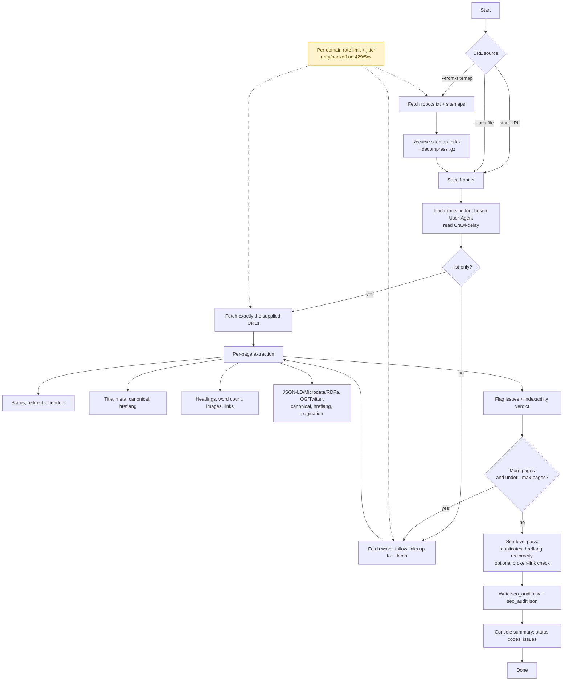

# SEO Audit Crawler

A small, domain-agnostic Python crawler that extracts the signals you actually
need for a technical SEO audit. Point it at a site (or feed it a URL list or an
XML sitemap), pick the **User-Agent** you want to crawl as, and get a per-page
**CSV + JSON** report plus a console summary of the most common issues.

Works on any domain. Nothing is hardcoded to one site.

> ### Want this run for you, on your data?
>
> This repo is the do-it-yourself version. If you'd rather hand off the whole
> job, I build custom crawls and data extracts tailored to your site:
> scheduled audits, JavaScript-rendered pages, log-file and Search Console
> joins, and the exact fields your team reports on, delivered as clean
> spreadsheets or dashboards.
>
> **Kiran Babu Thatha** — technical SEO + automation. Reach me at
> **<https://www.kiranbabuthatha.com>** to create custom extracts/crawls for
> SEO analysis.

## What it extracts

Per page, the crawler records:

- **Response**: final URL, status code, redirect chain, response time, content type.
- **Indexability**: a single verdict combining `meta robots`, the `X-Robots-Tag`
  header, the HTTP status, and the canonical, plus the reason it's non-indexable.
- **On-page**: title and meta description — both their character length **and
  estimated SERP pixel width** (Google truncates on pixels, not characters) —
  plus visible word count and **text-to-HTML ratio**.
- **Headings**: full `H1`–`H6` counts and a **document-order check** that flags
  skipped levels (e.g. `H2` → `H4`) and a first heading that isn't `H1`.
- **Canonical**: the canonical URL and whether it is self-referencing, read from
  **both the `<link>` tag and the HTTP `Link` header**, with **conflicting /
  multiple canonical** detection. With `--check-links`, the canonical target's
  HTTP status is validated too.
- **International**: every `hreflang` annotation (lang + URL), plus validation —
  **`x-default` presence, self-reference, malformed language codes, and
  reciprocal return-links** between crawled pages.
- **Links**: internal, external, `nofollow`, **`sponsored`, and `ugc`** counts;
  **empty and generic anchor text** ("click here") detection. With
  `--check-links`, every link is HEAD-checked for **broken (4xx/5xx) and
  redirecting** targets.
- **Images**: total, missing `alt`, **missing `width`/`height` (a CLS risk),**
  and **lazy-loaded** counts.
- **Social**: Open Graph and Twitter Card tags, with **completeness validation**
  (missing `og:image`, `og:url`, `twitter:card`, etc.).
- **Structured data**: JSON-LD `@type` values (parsed recursively) with
  **required-property validation** for common rich-result types, plus
  **Microdata (`itemtype`) and RDFa** detection.
- **Page hygiene**: `<base href>`, favicon, `rel="next"/"prev"` pagination,
  a **non-responsive-viewport** check, and **mixed-content** (insecure HTTP
  subresources on an HTTPS page) detection.
- **Security/perf headers**: HTTPS, HSTS, content-encoding, cache-control.
- **Site-level**: **duplicate `title`, meta description, `H1`, and self-canonical
  clusters** across the whole crawl (keyword-cannibalization / index-bloat
  signals).
- **Issues**: a per-page list of flagged problems (missing title, thin content,
  multiple `H1`s, canonical conflicts, and all of the above).

## Why the User-Agent option matters

Some sites serve different markup, redirects, or blocks to Googlebot than to a
desktop browser. Crawling as the bot you care about surfaces those differences.
The chosen User-Agent is applied to **every** request, including `robots.txt`,
so `robots` rules are evaluated for that specific agent.

| `--ua` value      | Crawls as                          |
| ----------------- | ---------------------------------- |
| `googlebot`       | Googlebot (desktop) — **default**  |
| `googlebot-mobile`| Googlebot (smartphone)             |
| `bingbot`         | Bingbot                            |
| `chrome-desktop`  | Chrome on Windows                  |
| `chrome-mobile`   | Chrome on Android                  |
| `custom`          | Your own string via `--ua-string`  |

## Install

```bash
pip install -r requirements.txt
```

`requests`, `beautifulsoup4`, and `lxml` are all that's required. To let the
crawler accept Brotli-compressed responses, optionally `pip install brotli`
(it advertises only the compression it can actually decode, so this is safe to
skip).

## Quick start

Verify everything works offline first (no network):

```bash
python test_crawler.py        # expect: ALL PASSED
```

Crawl a site as Googlebot mobile, following links up to depth 3:

```bash
python seo_crawler.py https://www.example.com --ua googlebot-mobile --max-pages 100
```

Audit exactly the URLs in a file, 8 at a time, with no link discovery:

```bash
python seo_crawler.py --urls-file examples/sample_urls.txt --list-only --workers 8
```

Audit every URL in the site's sitemap (auto-discovered via `robots.txt`):

```bash
python seo_crawler.py https://www.example.com --from-sitemap --list-only --max-pages 0
```

## Commands and flags

The crawler is a single command driven by flags. Provide a start URL, a
`--urls-file`, or `--from-sitemap` (any combination — they're merged and
deduplicated).

| Flag                  | Default      | Meaning                                                                       |
| --------------------- | ------------ | ----------------------------------------------------------------------------- |
| `url` (positional)    | (none)       | Start URL. Optional if `--urls-file` or `--from-sitemap` is given.            |
| `--ua`                | `googlebot`  | User-Agent profile to crawl as (see table above).                             |
| `--ua-string`         | (none)       | Custom User-Agent string; required when `--ua custom`.                        |
| `--urls-file`         | (none)       | Text file, one URL per line (`#` lines ignored).                              |
| `--from-sitemap`      | (none)       | Seed from sitemap(s). Pass a URL, or use the flag alone to auto-discover.     |
| `--max-sitemap-urls`  | `0`          | Cap URLs pulled from sitemaps; `0` = no cap.                                  |
| `--list-only`         | off          | Crawl only the supplied URLs — no link discovery / recursion.                 |
| `--workers`           | `5`          | Concurrent fetch workers.                                                     |
| `--max-pages`         | `50`         | Max pages to crawl; `0` = unlimited.                                          |
| `--depth`             | `3`          | Max crawl depth from the start URL.                                           |
| `--delay`             | `0.3`        | Minimum delay **per domain** between requests, in seconds.                    |
| `--retries`           | `3`          | Auto-retries on `429`/`5xx` with exponential backoff.                         |
| `--timeout`           | `15`         | Per-request timeout, in seconds.                                              |
| `--ignore-robots`     | off          | Do not respect `robots.txt`.                                                  |
| `--allow-external`    | off          | Allow crawling beyond the start domain.                                       |
| `--check-links`       | off          | HEAD-check every link (and canonical target) for broken/redirecting URLs.     |
| `--out`               | `seo_audit`  | Output filename prefix (`<prefix>.csv` and `<prefix>.json`).                  |

## Fast, without getting blocked

Speed comes from concurrent workers; politeness keeps you from getting blocked.
Both run at once:

- **Concurrency** (`--workers`) fetches several pages in parallel.
- **Per-domain rate limiting** spaces out requests to any single host by
  `--delay`, so parallelism never turns into hammering. Each gap is jittered
  (±~30%) to avoid a robotic, easily-fingerprinted pattern.
- **Automatic retry with backoff** honors `Retry-After` and backs off on `429`
  and `5xx` instead of giving up or retrying harder.
- **Connection pooling and keep-alive** cut handshake overhead.
- **`robots.txt` `Crawl-delay`** is read and honored for the chosen User-Agent.

The defaults (5 workers, 0.3s per domain) are tuned to be safe on sites you
don't control. For your own site you can raise `--workers` freely.

## Output

Two files are written per run:

- `<prefix>.json` — the full, nested per-page report.
- `<prefix>.csv` — a flat, spreadsheet-friendly summary (one row per page),
  including a `parse_ok` column so fetch/decode failures are obvious.

A console summary tallies status codes, indexable pages, and the most common
issues across the site.

## Input file format

A plain text file, one URL per line. Blank lines and `#` comments are ignored:

```
# examples/sample_urls.txt
https://www.example.com/
https://www.example.com/pricing
https://www.example.com/de/pricing
```

## Common gotchas

- **Everything reports as "missing".** Almost always a compression-decode
  problem: the server sent Brotli/zstd that your environment can't decompress.
  This crawler avoids it by advertising only `gzip`/`deflate` unless a decoder
  is installed, and it flags a single clear warning (with `parse_ok = false`)
  instead of a wall of false "missing tag" issues. Install `brotli` if you want
  Brotli support.
- **Only 50 pages crawled.** That's the `--max-pages` default. Use `0` for
  unlimited, or a higher number.
- **More pages than expected.** Without `--list-only`, supplied URLs are used as
  *seeds* and links are followed up to `--depth`. Add `--list-only` to audit
  exactly your list.
- **JavaScript-rendered pages show as empty.** This crawler reads raw HTML, not
  the post-JavaScript DOM. Server-rendered sites are fine; for client-rendered
  SPAs you need a headless browser (see below).

## Limitations

- Reads raw HTML — does not execute JavaScript. SPA/client-rendered content
  needs a headless-browser fetch layer (e.g. Playwright).
- Does not measure Core Web Vitals (LCP/INP/CLS); those need a real browser.
  Pair with the PageSpeed Insights API for field data.

Both are exactly the kind of extension I set up in custom builds — see below.

## Workflow

The diagram below shows how the crawler moves from input to output.



**Phase 1 — URL seeding.** The frontier is built from three non-exclusive sources: a positional start URL, a `--urls-file` (one URL per line), and `--from-sitemap` (auto-discovered from `robots.txt` or a URL you supply). Sitemap mode recursively resolves sitemap-index files and decompresses `.gz` archives before adding URLs to the queue. All sources are merged and deduplicated.

**Phase 2 — robots.txt + rate-limit setup.** Before the first fetch, the crawler loads `robots.txt` for the chosen User-Agent and reads the `Crawl-delay` directive. This is the point where User-Agent choice matters: each UA profile sends a distinct `User-Agent` header and is evaluated against the matching `robots.txt` rules.

**Phase 3 — crawl loop.** Two modes:
- `--list-only`: fetches exactly the seeded URLs with no link discovery.
- Default: follows internal links breadth-first up to `--depth`, stopping when `--max-pages` is reached (or the frontier is empty).

Politeness runs alongside every fetch: per-domain minimum delay (jittered ±30%), automatic retry with exponential backoff on `429`/`5xx`, and `Retry-After` header support.

**Phase 4 — per-page extraction.** Each fetched page is parsed for: HTTP status, redirect chain, and response headers; title and meta description (length **and** SERP pixel width); canonical (from the `<link>` tag and the `Link` header, with conflict detection) and hreflang (with `x-default`, self-reference, and code validation); the full `H1`–`H6` hierarchy and a heading-order check; word count and text-to-HTML ratio; images (missing-alt, missing-dimensions, lazy-load); link counts by `rel` type (`nofollow`/`sponsored`/`ugc`) and anchor-text quality; JSON-LD types (with required-property validation), Microdata, and RDFa; Open Graph / Twitter completeness; `<base>`, favicon, pagination, viewport responsiveness, and mixed content. A final indexability verdict is computed from the combination of `meta robots`, `X-Robots-Tag`, HTTP status, and canonical.

**Phase 5 — site-level analysis.** Once the crawl completes, `finalize()` runs passes that need the whole site in memory: duplicate `title` / meta / `H1` / self-canonical clustering, and hreflang reciprocity (return-link) validation. With `--check-links`, every unique internal and external link target (plus non-self canonicals) is HEAD-checked so broken (4xx/5xx) and redirecting links are attributed back to the pages that contain them.

**Phase 6 — output.** The crawler writes `<prefix>.csv` (flat, one row per page) and `<prefix>.json` (full nested report), then prints a console summary of status-code distribution and the most common per-page issues.

## Files

```
seo_crawler.py            The crawler (CLI entry point)
test_crawler.py           Offline test suite (no network)
examples/sample_urls.txt  Sample URL list
docs/workflow.mmd         Mermaid workflow diagram
requirements.txt          Dependencies
LICENSE                   MIT
```

## Hire me / custom crawls

This crawler covers the common audit. If you want a crawl or data extract built
around *your* site and *your* reporting, I set it up for you: JavaScript
rendering, scheduled runs, custom fields, log-file and Search Console joins, and
delivery as clean spreadsheets or dashboards.

Get in touch to have a custom extract or crawl built for your SEO analysis:
**<https://www.kiranbabuthatha.com>**

— Kiran Babu Thatha, technical SEO + automation.

## License

MIT — see [LICENSE](LICENSE). Copyright (c) 2026 Kiran Babu Thatha.
